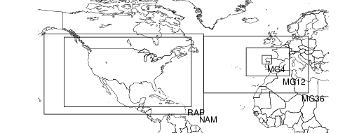
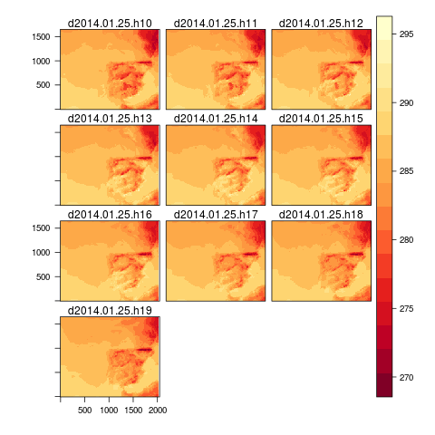
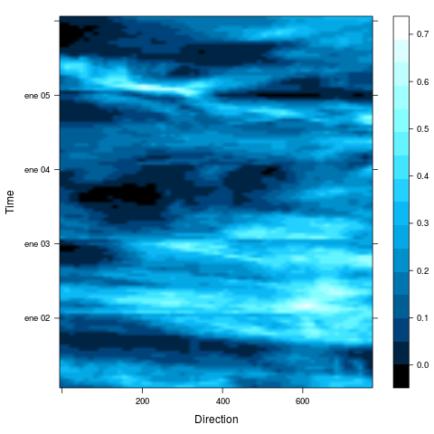
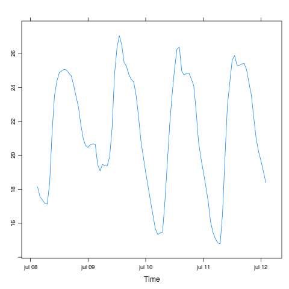
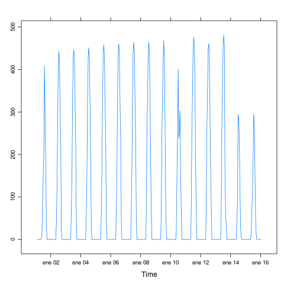
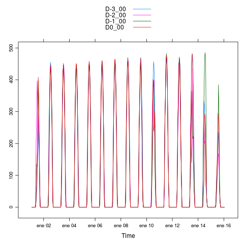
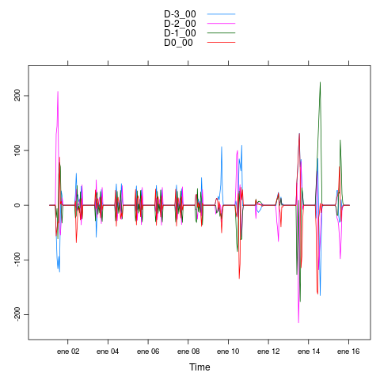

# meteoForecast

`meteoForecast` is a package to access outputs from Numerical Weather Prediction models both in raster format and as a time series for a location.
 The current version works with these services:

-   [GFS](https://www.ncei.noaa.gov/products/weather-climate-models/global-forecast)
-   [MeteoGalicia](https://www.meteogalicia.gal/web/modelos/threddsIndex.action)
-   [NAM](https://www.ncei.noaa.gov/products/weather-climate-models/north-american-mesoscale)
-   [RAP](https://www.ncei.noaa.gov/products/weather-climate-models/rapid-refresh-update)

New services will be added gradually, using [this collection](https://github.com/oscarperpinan/mds/wiki) of
meteorological data sources as reference.

This package has been developed in the framework of the European Project [PVCROPS](https://cordis.europa.eu/project/id/308468).

## Installation

The development version is available at GitHub:

    ## install.packages("remotes")
    remotes::install_github("oscarperpinan/meteoForecast")

The stable version is available at [CRAN](https://CRAN.R-project.org/package=meteoForecast/):

    install.packages('meteoForecast')

## Usage

    library(meteoForecast)

`grepVar` will help you to find the variable you need. If no day is defined, it will return the variables available in the current version of the service.

    grepVar('cloud', service = 'gfs')

    [1] "Cloud_water_entire_atmosphere_single_layer"
    [2] "Cloud_mixing_ratio_isobaric"               

However, you may be interested in the variables available in previous versions. It that is the case, choose a certain day to get this information:

    grepVar('cloud', service = 'meteogalicia', day = as.Date('2016-09-15'))

    [1] "cft" "cfm" "cfl" "cfh"

You can use the empty string to retrieve the full list of variables provided by the service.

    grepVar("", service = 'meteogalicia', complete = TRUE)

## Services

Each function admits an argument named `service` to choose the
service. After loading `meteoForecast` the default service is
Meteogalicia as reported with:

    mfService()

    [1] "meteogalicia"

You can choose a different service (for the running session) using
  `mfService` with the name of the service.

    mfService('gfs')

    Option service changed to gfs

    mfService('meteogalicia')

    Option service changed to meteogalicia

## Basic information about services

-   `mfProj4` provides the projection of a service:

    mfProj4('nam')

    [1] "+proj=lcc +lat_1=25 +lat_0=25 +lon_0=-95 +k_0=1 +x_0=0 +y_0=0 +a=6367470.21484375 +b=6367470.21484375 +units=km +no_defs "

-   `mfExtent` provides the extent of a service (using the class
    `Extent` defined by the package `raster`):

    mfExtent('meteogalicia', resolution = 36)

    class       : Extent 
    xmin        : -49.18259 
    xmax        : 18.789 
    ymin        : 24.03791 
    ymax        : 56.06608

### Raster Data

-   `getRaster` gets a forecast output inside a bounding box and
    provides a multilayer raster data using the `RasterBrick` class
    defined in the package `raster`.
    
        wrf <- getRaster(var = 'temp', day = '2014-01-25', run = '00')
    
        library(rasterVis)
        
        levelplot(wrf, layers = 10:21)

-   `getRasterDays` uses `getRaster` to download the results
    cast each day comprised between `start` and `end` using the
    00UTC run. 
    
        wrfDays <- getRasterDays('cft',
                              start = '2014-01-01',
                              end = '2014-01-05',
                              box = c(-2, 35, 2, 40))
        
        hovmoller(wrfDays, par.settings = BTCTheme,
                  interpolate = TRUE, panel = panel.levelplot.raster)

### Point Data

`getPoint`, `getPointDays`, and `getPointRuns` get data for a
certain location and produce a time series using the `zoo` class.

-   `getPoint`
    
        ## temperature (Kelvin) forecast from meteogalicia
        tempK <- getPoint(c(0, 40), vars = 'temp')
        ## Cell does not coincide exactly with request
        attr(tempK, 'lat')
        attr(tempK, 'lon')
        ## Units conversion
        tempC <- tempK - 273
    
        xyplot(tempC)

-   `getPointDays`
    
        ## Time sequence
        radDays <- getPointDays(c(0, 40), start = '2013-01-01',
                                end = '2013-01-15')
        
        xyplot(radDays)

-   `getPointRuns`
    
        ## Variability between runs
        radRuns <- getPointRuns(c(0, 40), start = '2013-01-01',
                                end = '2013-01-15')
        xyplot(radRuns, superpose = TRUE)

    ## variability around the average
    radAv <- rowMeans(radRuns)
    radVar <- sweep(radRuns, 1, radAv)
    xyplot(radVar, superpose = TRUE)

